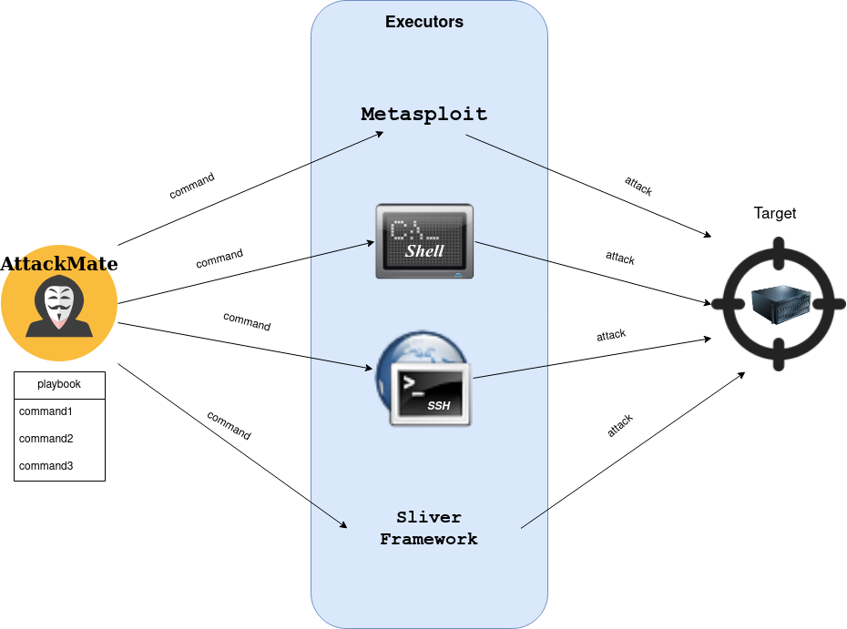

# AttackMate

AttackMate is an attack orchestration tool that executes full attack-chains based on playbooks.



# Requirements

AttackMate can use Metasploit-Module. For this feature it is
required to start the Metasploit-RPC-Daemon:

```
msfrpcd -P securepassword
```

# Installation

Manually:

```
$ git clone https://github.com/ait-aecid/attackmate.git
$ cd attackmate
$ pip3 install -e .
```

Using pip:

```
$ pip3 install attackmate
```

# Execute

```
$ attackmate --config playbook.yml
```

# Documentation

Please take a look at our documentation for how to install and use attackmate:

* [Installation](https://aeciddocs.ait.ac.at/attackmate/current/readme_link.html#)
* [Configuration](https://aeciddocs.ait.ac.at/attackmate/current/configuration/configuration.html)
* [Documentation](https://aeciddocs.ait.ac.at/attackmate)

## Security

If you discover any security-related issues read the [SECURITY.md](/SECURITY.md) first and report the issues.

## License

[GPL-3.0](LICENSE)
