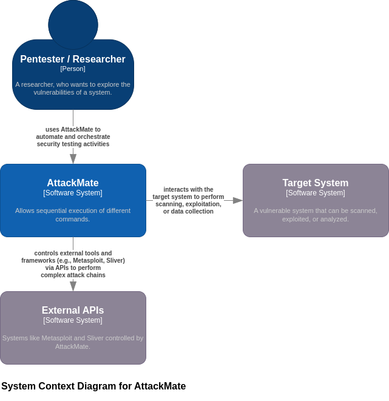
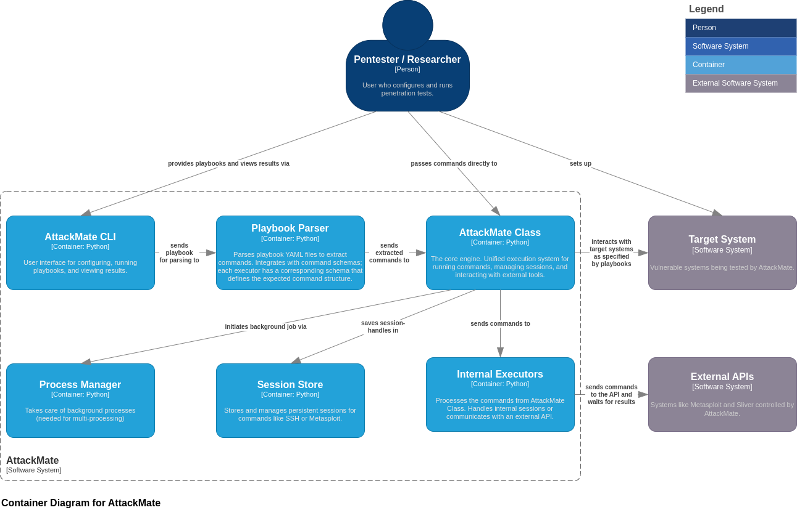

=======================
System Architecture (C4)
=======================

This section presents the architecture of AttackMate using the
`C4 model <https://c4model.com>`_, a visual framework for describing software architecture across different levels of detail.

C1 – System Context Diagram
---------------------------

The System Context diagram shows how **AttackMate** fits into its environment. It illustrates the main user
(e.g., a pentester or researcher), the software systems it interacts with (e.g., vulnerable target systems, external
frameworks like Metasploit or Sliver), and the nature of those interactions.

C2 – Container Diagram
----------------------

This diagram shows how AttackMate is internally structured as a modular Python application.

The system is centered around a core orchestration class that receives parsed playbook commands and delegates their
execution to appropriate components. It separates concerns between parsing, background task management, session handling,
and command execution, which makes it easy to extend with new command types or external tool integrations.

Future diagrams (e.g., C3 or C4) could describe class-level and code-level structures if needed.

.. note::
   The official C4 model site (https://c4model.com) provides detailed guidance if you're unfamiliar with this approach.
